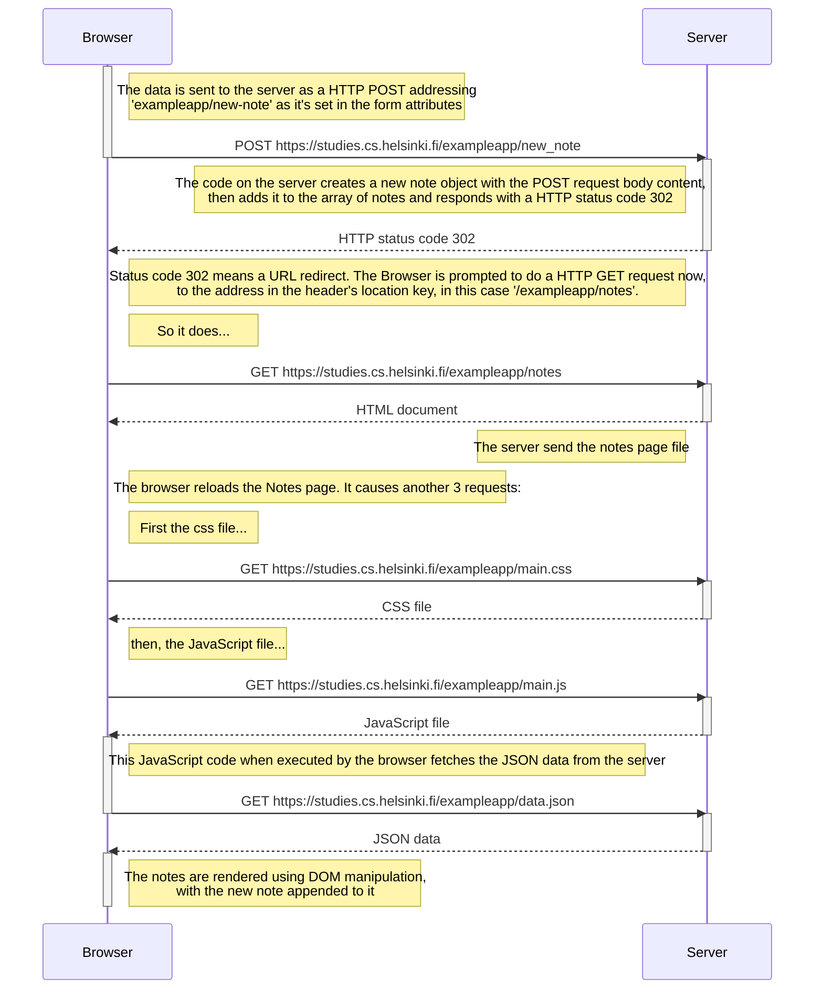

```mermaid

sequenceDiagram
    participant Browser
    participant Server
    
    activate Browser
    Note right of Browser: The data is sent to the server as a HTTP POST addressing<br /> 'exampleapp/new-note' as it's set in the form attributes
    Browser->>Server: POST https://studies.cs.helsinki.fi/exampleapp/new_note
    deactivate Browser
    
    activate Server
    Note left of Server: The code on the server creates a new note object with the POST request body content,<br /> then adds it to the array of notes and responds with a HTTP status code 302
    Server-->>Browser: HTTP status code 302
    deactivate Server
    Note left of Server: Status code 302 means a URL redirect. The Browser is prompted to do a HTTP GET request now,<br /> to the address in the header's location key, in this case '/exampleapp/notes'. 
        
    Note right of Browser: So it does...
    Browser->>Server: GET https://studies.cs.helsinki.fi/exampleapp/notes
    activate Server
    Server-->>Browser: HTML document
    deactivate Server
    Note left of Server: The server send the notes page file
    Note right of Browser: The browser reloads the Notes page. It causes another 3 requests:
    NOte right of Browser: First the css file...
    
    Browser->>Server: GET https://studies.cs.helsinki.fi/exampleapp/main.css
    activate Server
    Server-->>Browser: CSS file
    deactivate Server
    
    Note right of Browser: then, the JavaScript file...
    Browser->>Server: GET https://studies.cs.helsinki.fi/exampleapp/main.js
    activate Server
    Server-->>Browser: JavaScript file
    deactivate Server
    
    activate Browser
    Note right of Browser: This JavaScript code when executed by the browser fetches the JSON data from the server
    
    Browser->>Server: GET https://studies.cs.helsinki.fi/exampleapp/data.json
    deactivate Browser
    
    activate Server
    Server-->>Browser: JSON data
    deactivate Server
  
    activate Browser
    Note right of Browser: The notes are rendered using DOM manipulation,<br /> with the new note appended to it
    deactivate Browser
    
```