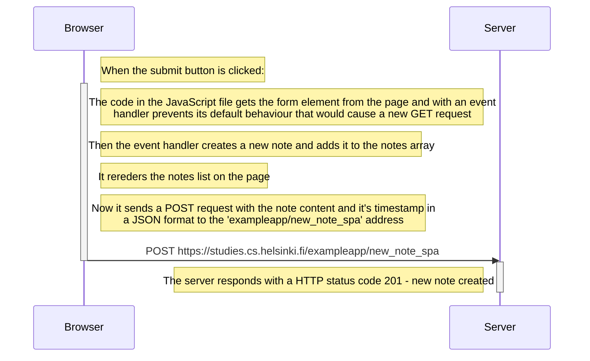

```mermaid

sequenceDiagram
  participant Browser
  participant Server
  
  Note right of Browser: When the submit button is clicked:
  activate Browser
  Note right of Browser: The code in the JavaScript file gets the form element from the page and with an event<br /> handler prevents its default behaviour that would  cause a new GET request
  Note right of Browser: Then the event handler creates a new note and adds it to the notes array
  Note right of Browser: It rereders the notes list on the page
  Note right of Browser: Now it sends a POST request with the note content and it's timestamp in<br /> a JSON format to the 'exampleapp/new_note_spa' address
  Browser->>Server: POST https://studies.cs.helsinki.fi/exampleapp/new_note_spa
  deactivate Browser
  
  activate Server
  Note left of Server: The server responds with a HTTP status code 201 - new note created
  deactivate Server

```