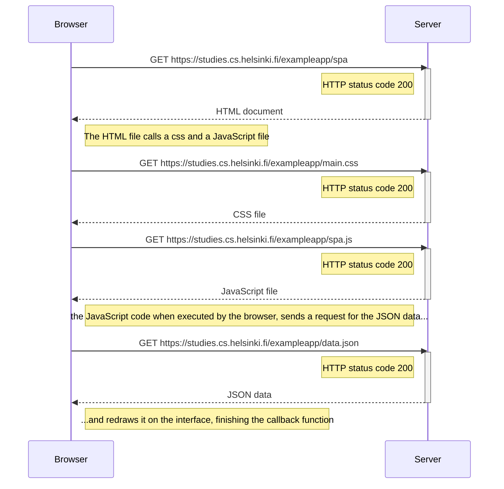

```mermaid

sequenceDiagram
  participant Browser
  participant Server
  
  Browser->>Server: GET https://studies.cs.helsinki.fi/exampleapp/spa
  activate Server
  Note left of Server: HTTP status code 200
  Server-->>Browser: HTML document
  deactivate Server
  
  Note right of Browser: The HTML file calls a css and a JavaScript file
  Browser->>Server: GET https://studies.cs.helsinki.fi/exampleapp/main.css
  activate Server
  Note left of Server: HTTP status code 200
  Server-->>Browser: CSS file
  deactivate Server
  
  Browser->>Server: GET https://studies.cs.helsinki.fi/exampleapp/spa.js
  activate Server
  Note left of Server: HTTP status code 200
  Server-->>Browser: JavaScript file
  deactivate Server
  
  Note right of Browser: the JavaScript code when executed by the browser, sends a request for the JSON data... 
  Browser->>Server: GET https://studies.cs.helsinki.fi/exampleapp/data.json
  activate Server
  Note left of Server: HTTP status code 200
  Server-->>Browser: JSON data
  deactivate Server
  
  Note right of Browser: ...and redraws it on the interface, finishing the callback function

```